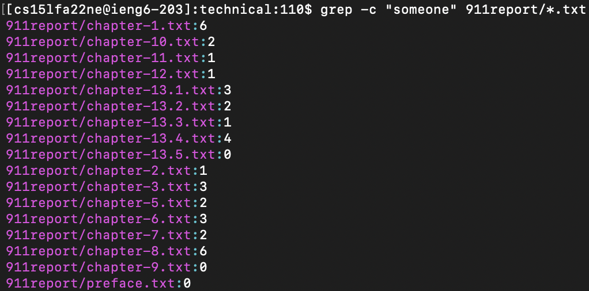
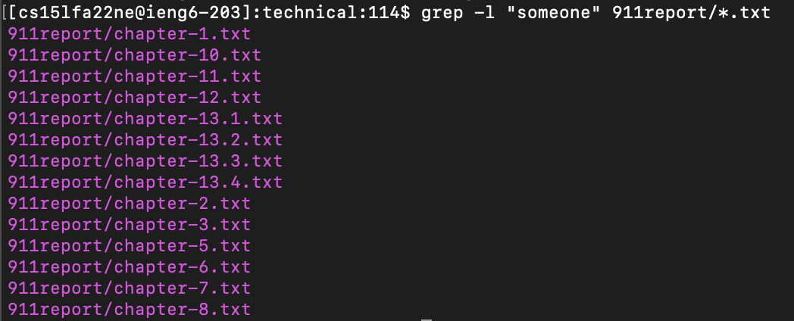

# Tutorial of Remote Access and File System
### 11/11/22
### Lab Report week 5
### Gunju Kim

## grep
> ###  1. -c option
## 
### -c option of grep returns the number of count of the lines in the files that matches the string. In this example, grep -c returned the number of lines that include "someone" for each text files in the 911 report directory. This can be useful when I'm looking for a file and I only remember the context and forget the name of the text file.
## 
### In the second example, I used grep -c in order to find the text files that includes the context about "DNA". This can be useful for finding which file includes context about DNA in the biomed directory.
## 
### In the third example, I used grep -c in order to find the text files that includes the context about "legal". This can be useful for finding which file includes legal issues about alcohol in the Alcohol_Problems directory.
> ###  2. -l option
## 
### -l option of grep returns the list of the text files that includes the pattern of the string. When you only need to know which text files include the string without knowing the exact lines, this can be useful. In this way, you can check all the name of the files on one screen. In the first example, I used grep-l to find the text files that include "someone" in 911-report directory.
## 
### In the second examples, I used grep-l to find the text files that include "DNA" in the biomed directory. Compared to grep-c, only the text files that include "DNA" are shown on the screen.
## 
### In the third examples, I used grep-l to find the text files that include "legal" in the Alcohol_Problems directory. Compared to grep-c, only the text files that include "legal" are shown on the screen.
> ###  3. -n option
## 
### -n option of grep prints the line number of the each line that matches the pattern of the string. This can be useful if you want to search for the specific line in the text file. In the first example, I used grep-n to find the line numbers that include "someone" in the text files of 911-report directory.
## 
### In the second example, I used grep-n to find the line numbers that include "DNA" in the text files of biomed directory. The text files with the line numbers are the text files shown in the grep-l command.
## 
### In the third example, I used grep-n to find the line numbers that include "legal" in the text files of Alcohol_Problems directory. The text files with the line numbers are the text files shown in the grep-l command.

