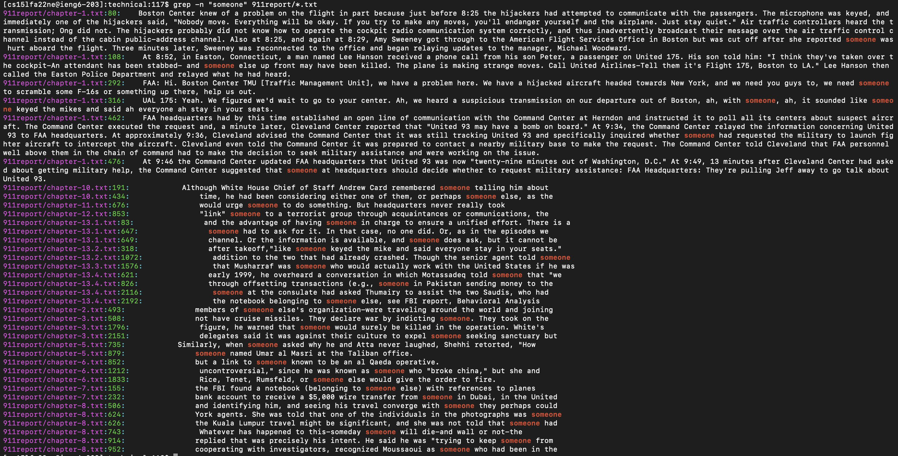

# Tutorial of Remote Access and File System
### 10/31/22
### Lab Report week 5
### Gunju Kim

## less
> ###  1. -? option
## 
### -? option of less returns the summary of the previous command line. In this example, the summary of the 'man less' was given on the new screen.
## 
### This option can be useful when the user wants to see the main point of the text files instead of the whole file.
> ###  2. -Q option
## 
### -Q option of less mute the sound of the terminal bell. When this option is used, no sound is made when the user makes an error or ends the screen. This can be useful when the user is using this command at the library or quiet place.
## 
> ###  3. -e option
## 
### -e option of less ends the screen when the end of the file is visited two times. This saves some time for the users because users do not have to press any other key to end the screen.
## 

## find
> ###  1. -readable option
## 
### -readable option of find returns the the files in the path that is readable. This can be useful when you are searching for the readable text files in the path.
> ###  2. -writable option
## 
### -writable option of find returns the the files in the path that is writable. This can be useful when you are searching for the writable text files in the path.
> ###  3. -newer option
## 
### -newer option of find returns the files that are motified more recently than the file next to the option. This can be useful when comparing the order of the time the files were modified.

## grep
> ###  1. -c option
## 
### -c option of grep returns the number of count of the lines in the files that matches the string. In this example, grep -c returned the number of lines that include "someone" for each text files in the 911 report directory. This can be useful when I'm looking for a file and I only remember the context and forget the name of the text file.
> ###  2. -l option
## 
### -l option of grep returns the list of the text files that includes the pattern of the string. When you only need to know which text files include the string without knowing the exact lines, this can be useful. In this way, you can check all the name of the files on one screen.
> ###  3. -n option
## 
### -n option of grep prints the line number of the each line that matches the pattern of the string. This can be useful if you want to search for the specific line in the text file.

